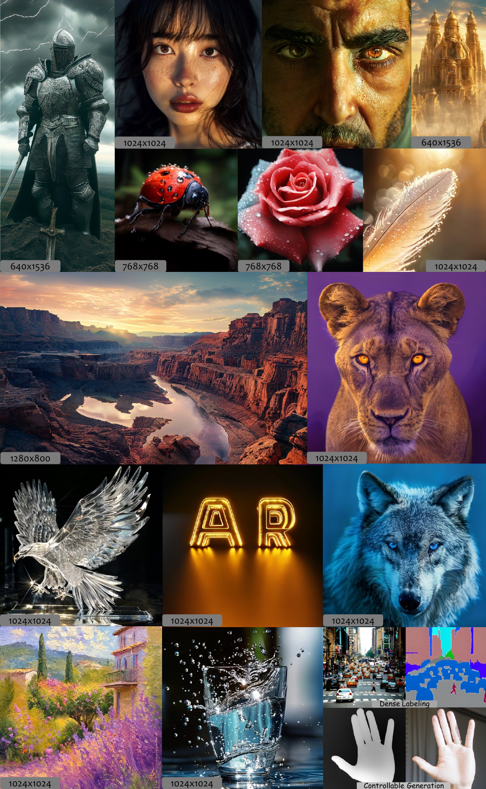
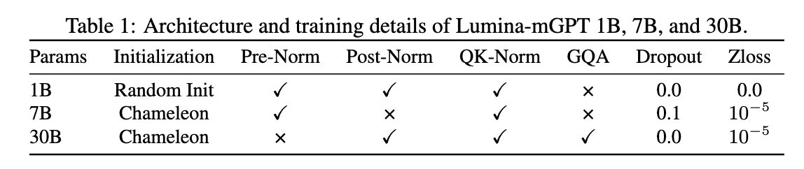
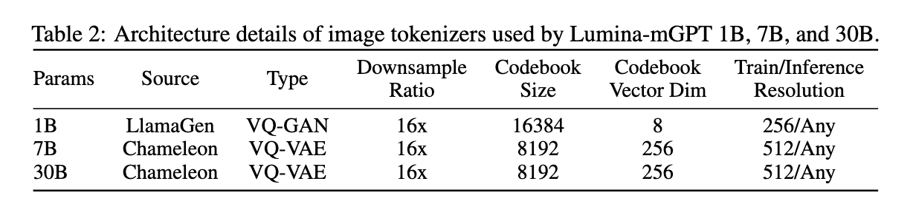

<div align="center">


# Lumina-mGPT

<b> A family of multimodal autoregressive models capable of various vision and language tasks, particularly excelling in generating flexible photorealistic images from text descriptions. 👋 join our <a href="http://imagebind-llm.opengvlab.com/qrcode/" target="_blank">WeChat</a> </b>

[](https://arxiv.org/abs/2408.02657)&#160;

[-6B88E3?logo=youtubegaming&label=Demo%20Lumina-mGPT)](http://106.14.2.150:10020/)&#160;
[-6B88E3?logo=youtubegaming&label=Demo%20Lumina-mGPT)](http://106.14.2.150:10021/)&#160;

</div>



## 📰 News

- **[2024-08-11] 🎉🎉🎉 [Training codes and documents](./lumina_mgpt/TRAIN.md) are released! 🎉🎉🎉**

- **[2024-07-08] 🎉🎉🎉 Lumina-mGPT is released! 🎉🎉🎉**

## ⚙️ Installation

See [INSTALL.md](./INSTALL.md) for detailed instructions.

Note that the Lumina-mGPT implementation heavily relies on
the [xllmx](./xllmx) module, which is evolved from [LLaMA2-Accessory](https://github.com/Alpha-VLLM/LLaMA2-Accessory) for supporting
LLM-centered multimodal tasks. Make sure it is installed correctly as a python package before going on.

## ⛽ Training
See [lumina_mgpt/TRAIN.md](lumina_mgpt/TRAIN.md)

## 📽️ Inference

> [!Note]
>
> Before using the Lumina-mGPT model, run
>
> ```bash
> # bash
> cd lumina_mgpt
> ```
>
> to enter the directory of the Lumina-mGPT implementation.

### Perpetration

Since currently the Chameleon implementation in transformers does not contain the VQ-VAE decoder, please manually download the original VQ-VAE weights [provided by Meta](https://github.com/facebookresearch/chameleon) and
put them to the following directory:

```
Lumina-mGPT
- lumina_mgpt/
    - ckpts/
        - chameleon/
            - tokenizer/
                - text_tokenizer.json
                - vqgan.yaml
                - vqgan.ckpt
- xllmx/
- ...
```

### Local Gradio Demos

We have prepared three different Gradio demos, each showcasing unique functionalities, to help you quickly become familiar with the capabilities of the Lumina-mGPT models.

#### 1. [demos/demo_image_generation.py](./Lumina-mGPT/demos/demo_image_generation.py)

This demo is customized for Image Generation tasks, where you can input a text description and generate a corresponding image.
To host this demo, run:

```bash
# Note to set the `--target_size` argument consistent with the checkpoint
python -u demos/demo_image_generation.py \
--pretrained_path Alpha-VLLM/Lumina-mGPT-7B-768 \
--target_size 768
```

#### 2. [demos/demo_image2image.py](./Lumina-mGPT/demos/demo_image2image.py)

This demo is designed for models trained with Omni-SFT. you can conveniently switch between the multiple downstream tasks using this demo.

```bash
# Note to set the `--target_size` argument consistent with the checkpoint
python -u demos/demo_image2image.py \
--pretrained_path Alpha-VLLM/Lumina-mGPT-7B-768-Omni \
--target_size 768
```

#### 3. [demos/demo_freeform.py](./Lumina-mGPT/demos/demo_freeform.py)

This is a powerful demo with minimal constraint on the input format. It supports flexible interation and is suitable for in-deep exploration.

```bash
# Note to set the `--target_size` argument consistent with the checkpoint
python -u demos/demo_freeform.py \
--pretrained_path Alpha-VLLM/Lumina-mGPT-7B-768-Omni \
--target_size 768
```

### Simple Inference

The simplest code for Lumina-mGPT inference:

```python
from inference_solver import FlexARInferenceSolver
from PIL import Image

# ******************** Image Generation ********************
inference_solver = FlexARInferenceSolver(
    model_path="Alpha-VLLM/Lumina-mGPT-7B-768",
    precision="bf16",
    target_size=768,
)

q1 = f"Generate an image of 768x768 according to the following prompt:\n"
     f"Image of a dog playing water, and a waterfall is in the background."

# generated: tuple of (generated response, list of generated images)
generated = inference_solver.generate(
    images=[],
    qas=[[q1, None]],
    max_gen_len=8192,
    temperature=1.0,
    logits_processor=inference_solver.create_logits_processor(cfg=4.0, image_top_k=2000),
)

a1, new_image = generated[0], generated[1][0]


# ******************* Image Understanding ******************
inference_solver = FlexARInferenceSolver(
    model_path="Alpha-VLLM/Lumina-mGPT-7B-512",
    precision="bf16",
    target_size=512,
)

# "<|image|>" symbol will be replaced with sequence of image tokens before fed to LLM
q1 = "Describe the image in detail. <|image|>"

images = [Image.open("image.png")]
qas = [[q1, None]]

# `len(images)` should be equal to the number of appearance of "<|image|>" in qas
generated = inference_solver.generate(
    images=images,
    qas=qas,
    max_gen_len=8192,
    temperature=1.0,
    logits_processor=inference_solver.create_logits_processor(cfg=4.0, image_top_k=2000),
)

a1 = generated[0]
# generated[1], namely the list of newly generated images, should typically be empty in this case.


# ********************* Omni-Potent *********************
inference_solver = FlexARInferenceSolver(
    model_path="Alpha-VLLM/Lumina-mGPT-7B-768-Omni",
    precision="bf16",
    target_size=768,
)

# Example: Depth Estimation
# For more instructions, see demos/demo_image2image.py
q1 = "Depth estimation. <|image|>"
images = [Image.open("image.png")]
qas = [[q1, None]]

generated = inference_solver.generate(
    images=images,
    qas=qas,
    max_gen_len=8192,
    temperature=1.0,
    logits_processor=inference_solver.create_logits_processor(cfg=1.0, image_top_k=200),
)

a1 = generated[0]
new_image = generated[1][0]

```

## 🤗 Checkpoints

**Configurations**




**7B models**

| Model        | Size | Huggingface                                                                              |
| ------------ | ---- | ---------------------------------------------------------------------------------------- |
| FP-SFT@512   | 7B   | [Alpha-VLLM/Lumina-mGPT-7B-512](https://huggingface.co/Alpha-VLLM/Lumina-mGPT-7B-512)       |
| FP-SFT@768   | 7B   | [Alpha-VLLM/Lumina-mGPT-7B-768](https://huggingface.co/Alpha-VLLM/Lumina-mGPT-7B-768)       |
| Omni-SFT@768 | 7B   | [Alpha-VLLM/Lumina-mGPT-7B-768-Omni](https://huggingface.co/Alpha-VLLM/Lumina-mGPT-7B-768-Omni) |
| FP-SFT@1024  | 7B   | [Alpha-VLLM/Lumina-mGPT-7B-1024](https://huggingface.co/Alpha-VLLM/Lumina-mGPT-7B-1024)     |

**34B models**

| Model      | Size | Huggingface                                                                          |
| ---------- | ---- | ------------------------------------------------------------------------------------ |
| FP-SFT@512 | 34B  | [Alpha-VLLM/Lumina-mGPT-34B-512](https://huggingface.co/Alpha-VLLM/Lumina-mGPT-34B-512) |

More checkpoints coming soon.

## 📑 Open-source Plan

- [X] Inference code
- [X] Training code

## 🔥 Open positions
We are hiring interns, postdocs, and full-time researchers at the General Vision Group, Shanghai AI Lab, with a focus on multi-modality and vision foundation models. If you are interested, please contact gaopengcuhk@gmail.com.

## 📄 Citation

```
@misc{liu2024lumina-mgpt,
      title={Lumina-mGPT: Illuminate Flexible Photorealistic Text-to-Image Generation with Multimodal Generative Pretraining},
      author={Dongyang Liu and Shitian Zhao and Le Zhuo and Weifeng Lin and Yu Qiao and Hongsheng Li and Peng Gao},
      year={2024},
      eprint={2408.02657},
      archivePrefix={arXiv},
      primaryClass={cs.CV},
      url={https://arxiv.org/abs/2408.02657},
}
```
